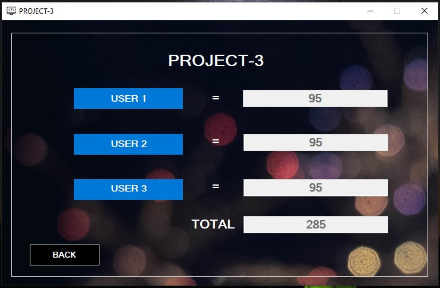

# CS-24 Project

* Purpose: (CS-24) Final Project of my college friend as my client
* Programming Language: C#
* Target Framework: .Net Framework 4.6.1
* IDE: MS Visual Studio 2012
* Backend Database: MS Access 2013
* Type of Application: Desktop Application (Windows Forms)  
* Printing Report: SAP Crystal Report
* Hashing Function: Bcrypt

<h2> User Interface Screenshots </h2> 
  
  
  
  
  
  
  
  
  
  
  
	
  
	  
  
				  
  
  
  
  
  
  
  
	
  
	  
  
  
<h2> Database Design from the scratch </h2> 
  
	
<h2> Database Design in MS Access </h2> 
  

<h2> Accounts that already created </h2>  

-Username: JCM  
-Password: JCM  
-Full Name: Joshua C. Magoliman  
-Secret Question: What is your job?  
-Secret Answer: JCM  

-Username: LEO  
-Password: LEO  
-Full Name: Leo M. De Villa  
-Secret Question: What is love for you?  
-Secret Answer: LEO  
  
  
